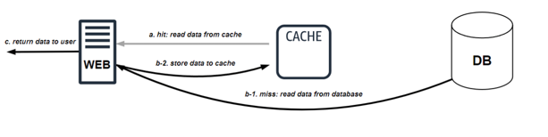
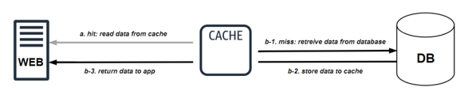
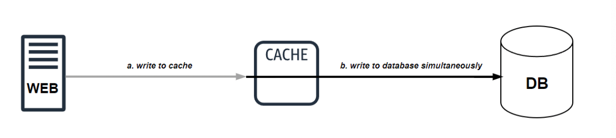
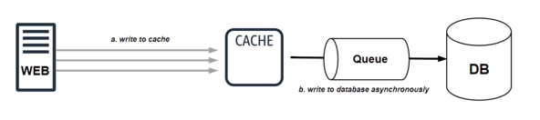
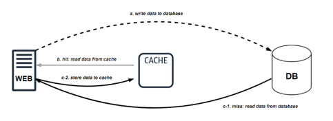

# 캐싱 전략

## 1. 캐시(Cache)
- 캐시는 자주 사용하는 데이터를 메모리에 임시로 저장하여 이후 요청을 빠르게 처리하는 저장소
- 웹 서버와 데이터베이스 사이에 캐시 계층을 두어 데이터베이스 호출 횟수를 줄여 성능을 향상시킬 수 있음

### 1. Cache-Aside (Lazy-Loading) 전략
- 가장 일반적인 전략. 애플리케이션이 직접 캐시를 확인하고, 데이터가 없으면 데이터베이스에서 가져와 캐시에 저장하는 방식
- 장점: 필요한 데이터만 캐시하므로 자원 효율적
- 단점: 첫 요청 시에는 데이터베이스 접근으로 인해 약간의 지연 발생

### 2. Read-Through 전략
- 캐시를 주 데이터 소스로 사용하는 방식. 애플리케이션은 캐시에만 요청을 보내고, 데이터가 없으면 캐시 계층이 알아서 데이터베이스에서 데이터를 가져와 동기화
- 장점: 애플리케이션이 캐시 로직에 관여하지 않아 코드가 간결해짐
- 단점: Cache-Aside와 마찬가지로 첫 요청 시 지연 발생

### 3. Write-Through 전략
- 쓰기 연산 시 캐시와 데이터베이스에 동시에 데이터를 저장하는 전략
- 장점: 캐시와 데이터베이스 간의 데이터 일관성을 강력하게 보장
- 단점: 쓰기 성능이 느릴 수 있음 (데이터베이스에 쓰기가 완료될 때까지 대기해야 하기 떄문)

### 4. Write-Behind (Write-Back) 전략
- 쓰기 연산 시 캐시에만 먼저 저장하고, 일정 주기마다 데이터를 데이터베이스에 일괄적으로 동기화하는 전략
- 장점: 쓰기 성능이 매우 빠름
- 단점: 캐시가 비정상적으로 종료될 경우 데이터가 유실될 위험이 있음

### 5. Write-Around 전략
- 쓰기 연산 시 캐시를 우회하여 데이터베이스에만 직접 저장하는 전략. 캐시는 주로 읽기 전용으로 사용
- 장점: 쓰기 연산으로 인한 캐시 오염을 막고 읽기 연산에 최적화 가능
- 단점: 자주 갱신되는 데이터의 경우 캐시에 최신 데이터가 없어 지연이 발생할 수 있음

---
### 6. 클라이어트 캐싱 
- 브라우저나 모바일 앱이나 자주 사용하는 데이터를 저장하는 방식
- HTTP 헤더의 Cache-Control과 ETag를 활용하면 불필요한 요청을 줄일 수 있음

### 7. CDN 캐싱
- 정적 파일(이미지, CSS, JavaScript 등)을 글로벌 CDN 서버에 저장해 빠르게 제공하는 방식
- Cloudflare, Akamai, AWS CloudFront 같은 서비스가 대표적

### 8. 애플리케이션 캐싱
- 서버 측에서 데이터를 캐싱하는 방식
- Redis나 Memcached 같은 인메모리 캐시 시스템을 활용하면 데이터베이스 부하를 줄일 수 있음

### 9. 데이터베이스 캐싱
- 쿼리 결과를 캐싱해 같은 요청이 반복될 때 더 빠르게 응답하는 방식
- MySQL의 Query Cache나 PostgreSQL의 Materialized Views 같은 기능을 활용

| 캐싱 방식          | 사용 예시             | 장점                           | 단점                           |
|--------------------|-----------------------|--------------------------------|--------------------------------|
| 클라이언트 캐싱    | 브라우저, 모바일 앱   | 빠른 로딩 속도, 서버 부하 감소 | 데이터 변경 시 즉각 반영 어려움 |
| CDN 캐싱           | 정적 파일, 이미지     | 전 세계 빠른 응답, 대역폭 절감 | 실시간 데이터에는 부적합        |
| 애플리케이션 캐싱  | Redis, Memcached      | 데이터베이스 부하 감소         | 메모리 사용량 증가              |
| 데이터베이스 캐싱  | MySQL Query Cache     | 반복 쿼리 속도 개선            | 대규모 트랜잭션 처리 어려움     |
