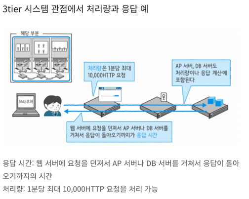

# 시스템 설계 병목 분석

## 1. 정의

### 1.1 병목현상 이란?
- 시스템 내에서 전체적인 처리 속도를 떨어뜨리게 되는 특정한 부분
- 시스템의 CPU나 메모리, 디스크 등의 자원 중 하나가 다른 자원들에 비해 처리 속도가 느려서, 전체적인 성능을 제한하는 경우

> 성능 분석의 시작은 병목 현상이 발생하고 있는 **위치**를 정확히 파악하는 것  

## 2. 원인

### 2.1 응답과 처리량
- 시스템 성능을 가르킬 때 응답(Reponse)과 처리량(Throughput)이라는 지표가 자주 사용됨
- 응답 :  처리 하나당 소요 시간을 의미
- 처리량 : 단위 시간당 처리하는 양을 의미

### 2.2 응답 문제

- 사용자 체감 시간에는 각 계층의 처리 시간이 포함되므로 응답 문제가 발생하는 위치는 로그나 실제 장비 시험 등을 통해서 구체적으로 어떤 계층에서 응답 지연이 발생하고 있는지 파악
- 각 서버 이상으로 인한 응답 시간 지연은 로그 등을 보면 어느 정도 문제 파악이 가능
- 하지만, 네트워크 문제는 물리적인 한계를 가지고 있음. (cf. 시스템에 도달하기까지의 경로가 복잡한 경우)
- 따라서, 응답 시간 개선에 한계가 보일 때는 처리량 개선을 통해서 시스템 전체 사용률을 개선하는 것이 일반적

### 2.3 처리량 문제
- 대량의 데이터를 교환하고 싶은데 영역이 부족한 경우에 처리량 문제가 발생
- 물리적으로 데이터를 통과시킬 수 없을 때 처리량 관점의 병목 현상이 발생

> 응답이 매우 느린 시스템은 다수의 사용자 요청이 시스템에 누적되므로 전체 처리량도 낮아짐

## 3. 해결방법

1. 병목 위치를 파악해서 해결
   - 병목 위치를 작은 단위로 세분화해서 병목 영역을 더 집중적으로 접근하는 방법
2. 시스템 이용자 수를 제한
   - 유량제어
   - 근본적인 해결책은 되지 못함

> 병목지점은 반드시 존재한다.
- 인프라를 구축할 때 "특정 응답은 몇 퍼센트 개선시킨다." 와 같은 목표를 만드는 것이 매우 중요

## 4. 3계층형 시스템을 통해 본 병목 현상

### 4.1 CPU 병목 현상 

- CPU 사용률은 처리 효율성을 나타내는 것
- CPU 사용률 100% = 비효율 X  
  → 오히려 다른 계층이 빠르게 처리되어 CPU가 마지막 병목 지점일 수 있음
- 문제 여부 판단: 응답 속도, 전체 처리량 확인 필요

#### 원인1. 대기 행렬의 병목

- CPU 100% 가동해도 대기열이 줄지 않음 → 처리량 문제 발생

#### 원인1 해결방법
  - CPU를 코어 수가 많은 것으로 변경
  - 서브를 추가해서 병렬 처리하면 처리량이 증가
  - 처리 자체를 짧게 만드는 방법 
  - 대규모 웹 서비스 시스템에서는 사용자 증가에 맞추어 서버를 추가해서 스케일아웃하는 아키텍처를 도입하는 것이 필수

 > 스케일 아웃(Scale Out) : CPU 코어 수를 늘리거나 수평 분할에 따른 서버 수를 늘리는 튜닝 (= 규모를 크게 만든다)

#### 원인2. 응답의 병목

- CPU 성능 부족
- 처리시간 자체가 느리면 병행 처리가 아무리 늘어난다고 해도 응답 시간에는 큰 차이가 없음

#### 원인2 해결방법

1. 병렬로 처리하는 방법
  - 처리를 분할해서 다수의 CPU 코어에게 동시 처리를 시키는 것
  - 멀티 프로세스화, 멀티 스레드화해서 복수의 CPU 코어를 이용함으로써 전체적인 처리 응답 시간을 향상시킬 수 있음
  - 처리를 병렬화 할 수 있는가가 중요
  - 병렬화 검토는 인프라만으로 한계가 있기 때문에 애플리케이션 개발자의 협조가 필요

2. 처리 능력 향상
> 스케일 업(Scale-up) : CPU의 성능(클럭)을 높이는 것
- 스케일업으로 성능을 향상시키는 것은 한계 있음

### 4.2 CPU 사용률이 오르지 않는 경우

- 보통 CPU 사용률이 100%에 도달하는 경우가 거의 없다. 그 전에 디스크, 네트워크 I/O 에서 막히는 경우가 많기 때문
- 이런 경우 CPU 사용률이 낮아도 I/O 대기 큐에서 대기하는 프로세스 수가 증가
- 이 상태는 CPU 병목 현상보다는 I/O 병목 현상에 가까움
- 특히, 데이터베이스는 I/O가 많아서 발생 빈도가 높음

#### 해결방법
1. 처리 다중화
   - 처리 병렬화와 같은 개념
   - 쓰레드를 여러개 가동해 동기 I/O 명령을 스레드 단위로 병행해서 실행하면 CPU 사용률도, I/O 부하도 증가
   - 이를 통해 서버 전체의 리소스 사용 상태 개선 
   
2. I/O 비동기화
    - 비동기 I/O를 이용하면 프로세스는 I/O처리 완료를 기다리지 않고 다음으로 넘어 갈 수 있다
    - CPU 처리와 I/O 처리를 동시에 진행할 수 있기 때문에 리소스 사용 상태가 개선

### 4.2 메모리 병목 현상 

#### 원인1. 영역 부족에 의한 병목현상

- 프로세스가 가동하려면 반드시 전용 메모리 영역이 필요하지만 서버상의 메모리 영역은 유한함
- 메모리 영역이 부족하지 않도록 OS 커널 측에서 페이징 또는 스와핑이라는 처리를 해서 빈 메모리를 확보하는 구조가 있음
- 부족한 부분은 디스크 영역으로 보완해서 가상적인 큰 메모리가 있다는 것을 보여주는 기술로 이를 가상 메모리(Virtual Memory)라고 함
- 하지만, 메모리와 디스크에는 압도적인 성능 차이가 있으므로 성능 저하가 발생

#### 원인2. 동일 데이터에 대한 병목 현상

- 전부 캐시하면 문제를 해결할 수 있는 것 아닌가라고 생각하지만 아님
- 메모리에서 경합이 발생하는 경우가 있음
- 특정 영역을 복수의 프로세스가 공유하는 경우, 메모리 영역을 참조 또는 갱신할 때 누군가가 그 영역을 관리할 필요가 생김
- 이런 문제를 해결하려면 애초에 경합이 발생하지 않도록 복수의 프로세스나 스레드가 같은 메모리 영역을 참조하지 않도록 만들면 됨

### 4.3 디스크 I/O 병목 현상 

#### 원인1. 외부 저장소
- 기업형 환경에서는 데이터베이스의 저장 위치로 외부 저장소를 사용하는 경우가 있음
- SAN 을 경유하는 SAN 저장소나 네트워크를 경유하는 Network Attached Storage(NAS) 저장소가 있음
- 단일 응답은 로컬 디스크가 가장 빠름
- 처리량 관점에서는 수십 대에서 수백 대 단위의 디스크를 배치하고, 거기에 전용 캐시 전용 메모리 영역까지 갖춘 외부 저장소가 유리
- 디스크 수에 따라 처리량이 증가하기 때문

#### 원인2. 순차 I/O와 랜덤 I/O

- 디스크 I/O에는 순차 액세스와 랜덤 액세스가 있음
- 순차 I/O : 단일 디스크가 기록 위치인 경우, 큰 파일에 액세스 하는 경우에 빠름
- 랜덤 I/O : 작은 파일에 액세스 하는 경우, 데이터가 분산된 경우에 빠름

### 4.4 네트워크 I/O 병목 현상 
- 네트워크를 경유한 I/O 는 응답 시간 오버헤드가 큼
- 이 때문에 응답을 근본적으로 개선하는 것은 어려우며, 처리량을 개선하는 접근법이나 네트워크 I/O 자체가 발생하지 않도록 하는 방법이 효과적

#### 원인1. 통신 프로레스의 병목 현상

- 대역이 크면 고속 통신이라고 착각하기 쉽지만 하나의 프로세스로 처리하는 경우 높은 처리량을 실현하기는 어려움
- 이유는 통신에는 반드시 '데이터 전송', '통신 결과 확인' 같은 처리가 포함되므로 항상 풀 파워로 송수신이 이루어지지 않기 때문
- 또한, 통신이 고속화되면 CPU에서 병목 현상이 발생할 수도 있음
- 통신에서 대역을 모두 사용하려면 처리를 다중화해서 병렬화할 필요
- 압축을 이용해서 전송량을 줄이는 방법도 있으나 압축 및 해제 시 발생하는 CPU 오버헤드를 감안해야 함

#### 원인2. 네트워크 경로의 병목 현상

- 네트워크에서는 눈에 보이지 않는 부분이 병목 지점이 되기 쉬움
- 예를 들어, DB 에 많은 비용을 투입하였으나 예상한것보다 응답 속도가 느린 경우, 비교적 리소스를 많이 사용하는 AP 서버를 증성했지만, 성능에는 전혀 변화가 없을 수 있음
- 이럴때는 기본 게이트웨이가 원인인 경우
- 게이트웨이인 특정 라우터가 여러 시스템과 클라이언트 사이의 큰 트랜잭션을 소화하느라 처리 한계에 다다른 경우
- 이런 경우는 특정 구간의 전용 네트워크를 증설해서 트래픽을 분할하여 해결
- 시스템을 신규 구축할 때는 경로와 트래픽 증감에 대해서도 검토

### 4.5 애플리케이션 병목 현상 
> 인프라 측은 스케일업, 스케일아웃 등의 개념을 통해 개선 가능
> 하지만 애플리케이션자체가 병목 지점이 되는 경우가 있음
> 알고리즘의 문제라면 인프라 측 리소스를 아무리 늘려도 처리량이 높아지지 않아 응답 속도를 개선할 수 없음

#### 원인1. 데이터 갱신의 병목현상

- 자주 발생하는 것이 특정 데이터에 의존하는 처리가 병목 지점이 되는 것

#### 해결방법1. 값의 캐시화

- 서버에 질의를 던지는 것이 병목 지점이 된다면, 더 가까운 장소에 캐시화하는 것이 일반적인 방법 
- 단, 네트워크를 경유하는 질의가 없어지므로 처리 효율이 개선될 수 있지만, 병목에 대한 근본적인 해결책은 되지 못함

#### 해결방법2. 병목 지점의 분할
- 재고 확인을 엄밀하게 처리하지 않고 레코드를 두 개로 나누는 형태 
- 예를 들어, 재고가 200개가 있다고 하면 100개씩 레코드를 분할하여 처리를 다중화 하는것이 가능하다
- 결과적으로는 재고가 몇 개 있는지 확인하는 데이터 일치성 문제와 한쪽이 먼저 고갈된 경우 데이터 최신성 문제가 새롭게 발생

#### 원인2. 외부 질의의 병목 현상

- 시스템이 다른 시스템과 데이터 연계하는 경우 병목 지점이 됨
- 예를 들어, 기반 시스템의 사용자 관리를 일원화하는 프로젝트를 진행 후 일괄 처리에서 큰 폭의 처리 지연이 발생해서 처리가 예정 시간 내에 끝나지 않는 경우
- 원인은 1트랜잭션을 실행 시마다 사용자 정보를 확인하는 처리가 있었기 때문
- 로컬에서는 질의 시간이 짧지만 분리된 시스템을 조회할 경우에는 I/O 병목 현상이 발생
- 이 경우 1회 질의로 1일괄 처리 내의 사용자 정보를 취득하고, 애플리케이션 측에서 일차 파일을 캐시로 저장해서 차이만 확인하는 방법으로 해결

